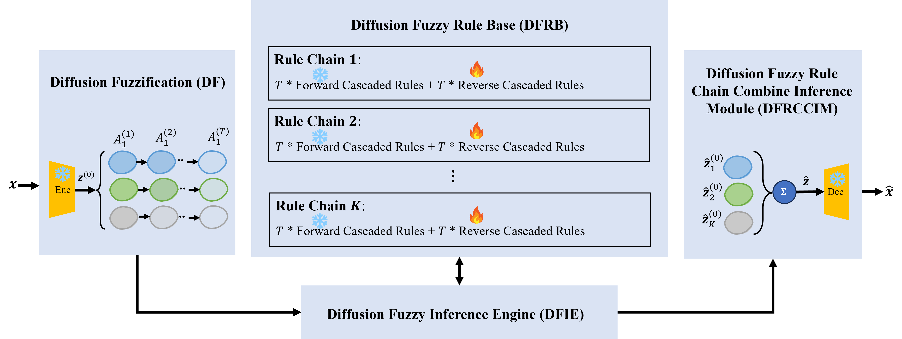
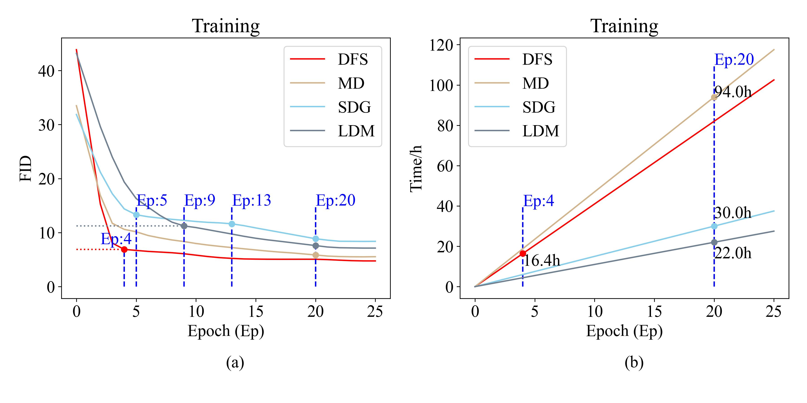

<!-- <p align="center">

</p> -->
<h1 align="center">
Diffusion Fuzzy System: Fuzzy Rule Guided Latent Multi-Path Diffusion Modeling
</h1>
<p align="center">


</p>

<p align="center">
 <br>
<b>Figure 1</b>: The structure of DFS.
</p>

<p align="justify">
Diffusion models have emerged as a leading technique for generating images due to their ability to create high-resolution and realistic images. Despite their strong performance, diffusion models still struggle in managing image collections with significant feature differences. They often fail to capture complex features and produce conflicting results. Research has attempted to address this issue by learning different regions of an image through multiple diffusion paths and then combining them. However, this approach leads to inefficient coordination among multiple paths and high computational costs. To tackle these issues, this paper presents a Diffusion Fuzzy System (DFS), a latent-space multi-path diffusion model guided by fuzzy rules. DFS offers several advantages. First, unlike traditional multi-path diffusion methods, DFS uses multiple diffusion paths, each dedicated to learning a specific class of image features. By assigning each path to a different feature type, DFS overcomes the limitations of multi-path models in capturing heterogeneous image features. Second, DFS employs rule-chain-based reasoning to dynamically steer the diffusion process and enable efficient coordination among multiple paths. Finally, DFS introduces a fuzzy membership-based latent-space compression mechanism to reduce the computational costs of multi-path diffusion effectively. We tested our method on three public datasets: LSUN Bedroom, LSUN Church, and MS COCO. The results show that DFS achieves more stable training and faster convergence than existing single-path and multi-path diffusion models. Additionally, DFS surpasses baseline models in both image quality and alignment between text and images, and also shows improved accuracy when comparing generated images to target references.
</p>

## Conda Enviroment Setup

> Our project relies on [LDM](https://github.com/CompVis/latent-diffusion) project.

``` shell
conda create --name dfs --file ./requirements.txt
conda activate dfs
```

## Datasets

### LSUN
<p align="justify">
The Large-scale Scene Understanding (LSUN) challenge aims to provide a different benchmark for large-scale scene classification and understanding. The LSUN classification dataset contains 10 scene categories, such as dining room, bedroom, chicken, outdoor church, and so on. For training data, each category contains a huge number of images, ranging from around 120,000 to 3,000,000. The validation data includes 300 images, and the test data has 1000 images for each category. https://github.com/fyu/lsun
</p>


To facilitate the experiments, we examined the LSUN Bedroom and LSUN Church datasets and provided [download link](https://gofile.me/7y6ht/61yKRTxNi) for zip (92GB, `unzip lsun.zip`) . After downloading, place the `lsun` folder into the `datasets` directory located at the root of the project, as shown below:

```shell
xxx@xx:~/xxx/github/fuzzydiffusion/datasets/lsun$ ll
drwxrwxr-x  8 yang yang      4096 Nov 24  2023 ./
drwxrwxr-x 13 yang yang      4096 Apr 25 11:28 ../
drwxrwxr-x  2 yang yang 248651776 Nov 22  2023 bedrooms_train/
-rw-rw-r--  1 yang yang 139289932 Sep 25  2023 bedrooms_train.txt
drwxrwxr-x  2 yang yang     32768 Nov 21  2023 bedrooms_val/
-rw-rw-r--  1 yang yang    230000 Nov 21  2023 bedrooms_val.txt
drwxrwxr-x  2 yang yang  10420224 Nov 21  2023 churches_train/
drwxrwxr-x  2 yang yang     28672 Nov 21  2023 churches_val/
-rw-rw-r--  1 yang yang   5576442 Sep 25  2023 church_outdoor_train.txt
-rw-rw-r--  1 yang yang    230000 Sep 25  2023 church_outdoor_val.txt
```

### MS_COCO
<p align="justify">
The MS COCO (Microsoft Common Objects in Context) dataset is a large-scale object detection, segmentation, key-point detection, and captioning dataset. The dataset consists of 328K images. 

HuggingFace: https://huggingface.co/datasets/ChristophSchuhmann/MS_COCO_2017_URL_TEXT

MS_COCO is automatically downloaded in `loader.py`, so no manual work is required.
</p>

### Load Datasets

``` shell
cd src
python3 loader.py
```
log output:
``` log
2025-04-25 12:55:23.139 | INFO     | __main__:read_dataset:50 - ChristophSchuhmann/MS_COCO_2017_URL_TEXT- done
2025-04-25 12:55:23.140 | INFO     | __main__:data_preload:98 - ChristophSchuhmann/MS_COCO_2017_URL_TEXT data preload start
2025-04-25 12:55:23.145 | INFO     | __main__:read_dataset:50 - ChristophSchuhmann/MS_COCO_2017_URL_TEXT- done
data preload: 100%|████████████████████████████████| 591753/591753 [00:23<00:00, 25651.73it/s]
2025-04-25 12:55:46.218 | INFO     | __main__:data_preload:118 - ChristophSchuhmann/MS_COCO_2017_URL_TEXT data preload done
2025-04-25 12:55:46.218 | INFO     | __main__:data_preload:314 - LSUN/bedrooms-train data preload start
100%|████████████████████████████████| 3028042/3028042 [00:04<00:00, 671985.22it/s]
2025-04-25 12:55:50.884 | INFO     | __main__:data_preload:339 - LSUN/bedrooms-train data preload done
2025-04-25 12:55:50.940 | INFO     | __main__:data_preload:314 - LSUN/churches-train data preload start
100%|███████████████████████████████| 121227/121227 [00:00<00:00, 859921.34it/s]
2025-04-25 12:55:51.087 | INFO     | __main__:data_preload:339 - LSUN/churches-train data preload done
done
```
## Image Set Delegates For Rule Antecedents
To construct the rules, [2,...,10] representatives are selected.
```shell
python3 fcm.py
```
The representative selection for MS_COCO is as follows:
```shell
...
-rw-rw-r-- 1 yang yang  5556 Apr 25 15:31 coco_3_delegates_1.jpg
-rw-rw-r-- 1 yang yang  9585 Apr 25 15:31 coco_3_delegates_2.jpg
-rw-rw-r-- 1 yang yang 11917 Apr 25 15:31 coco_3_delegates_3.jpg
-rw-rw-r-- 1 yang yang   260 Apr 25 15:31 coco_3_delegates.csv
-rw-rw-r-- 1 yang yang 16955 Apr 25 15:31 coco_4_delegates_1.jpg
-rw-rw-r-- 1 yang yang  9757 Apr 25 15:31 coco_4_delegates_2.jpg
-rw-rw-r-- 1 yang yang  9157 Apr 25 15:31 coco_4_delegates_3.jpg
-rw-rw-r-- 1 yang yang  5556 Apr 25 15:31 coco_4_delegates_4.jpg
-rw-rw-r-- 1 yang yang   343 Apr 25 15:31 coco_4_delegates.csv
...
```
## Train and Test

train model on LSUN datasets through `lsun.py`, rule number default `3`.


```shell
python3 lsun.py
```
```python
lsun_train('churches', 
            f"{options.base_path}src/config/latent-diffusion/lsun_churches-ldm-kl-8.yaml",
            f"{options.base_path}output/delegates/lsun_church/lsun_church_3_delegates.csv",
            3)
lsun_train('bedrooms', 
            f"{options.base_path}src/config/latent-diffusion/lsun_bedrooms-ldm-vq-4.yaml",
            f"{options.base_path}output/delegates/lsun_bedroom/lsun_bedroom_3_delegates.csv",
            3)
```

<p align="center">
 <br>
<b>Figure 2</b>: The convegence curve of DFS
</p>


The testing program is automatically triggered upon the completion of training.
```python
logger.info("lsun test start")
lsun_test(dataset_name, fldmodel, root_path)
logger.info("lsun test done")
logger.remove(log_file)
```

train model on MS_COCO dataset through `coco.py`, rule number default `3`.

```shell
python3 coco.py
```

```python
coco_train(f"{options.base_path}src/config/latent-diffusion/txt2img-1p4B-eval.yaml",
           f"{options.base_path}output/delegates/coco/coco_3_delegates.csv",
           3)
```

The testing program is automatically triggered upon the completion of training.

```python
logger.info("coco test start")
coco_test(fldmodel, root_path)
logger.info("coco test done")
logger.remove(log_file)
```

<p align="center">
 <br>
<b>Figure 3</b>: Images generated by DFS with the specified
prompts.
</p>


